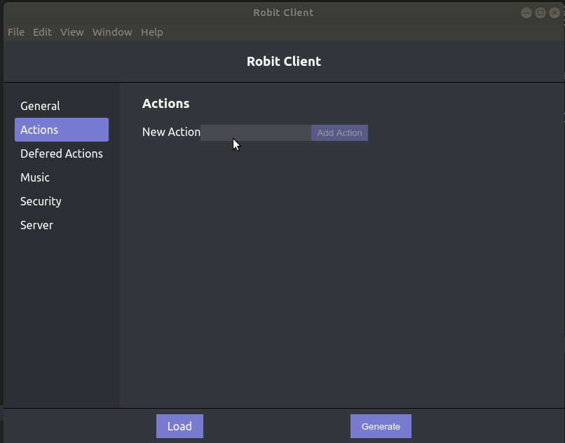

# robitclientnative
Robitclientnative is a native application for [somerobit](https://github.com/JeffreyRiggle/somerobit) and [robitclient](https://github.com/JeffreyRiggle/robitclient). This application is an electron based application that allows you to configure and run somerobit.

## Building
In order to build this application you can run either `yarn run build` or `yarn run dist`

## Local Dev environment.
In order to test this on a local developer machine you must first start [robitclient](https://github.com/JeffreyRiggle/robitclient) then you can run `yarn run dev`
