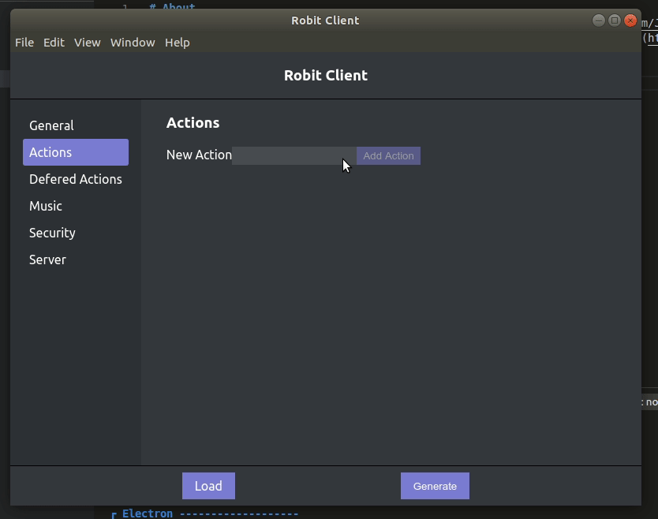

# About
Robitclientnative is the native version of [robitclient](https://github.com/JeffreyRiggle/robitclient). In the native version you can not only configure [somerobit](https://github.com/JeffreyRiggle/somerobit) but you can actually run it as well.

